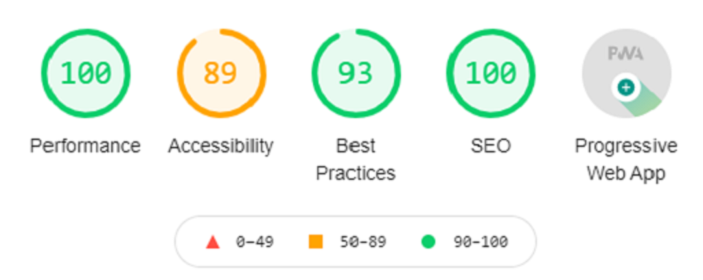

add demo site
commit this to github 


clone

setup
- new firebase app
- run firebase init (func and host)
- edit what
- setup firebase fucntions in folder

deploy


add stuff in .env
https://nextjs.org/docs/basic-features/environment-variables

https://www.npmjs.com/package/dotenv


# NextJS PWA Firebase Template



This PWA Template is intended to be hosted on [Firebase](https://firebase.google.com)

[Demo Site]()

## Getting Started

First, run the development server:

```bash
npm run dev
# or
yarn dev
```

Open [http://localhost:3000](http://localhost:3000) with your browser to see the result.

You can start editing the page by modifying `pages/index.js`. The page auto-updates as you edit the file.


## Deployment

After inputting all the configurations, run `npm run deploy` to build the NextJS app and deploy to Firebase Hosting


## Client-Side Firebase Integration

Rename the `dotenv` file to `.env` and add your credentials into it and use it in a page like so:

```js
import firebase from '../path/to/lib/firebase';

firebase.firestore().collection('foo').doc('bar').get()
.then(doc => {
    // do stuff
}).catch(err => console.error({ err }))
``` 

Alternatively, you can use [`useSWR`](https://github.com/vercel/swr) and query `api/my-collection` to get firebase data.

```jsx
import useSWR from 'swr'

const fetcher = async (...args) => {
    const res = await fetch(...args);
    return res.json();
};

export default function WaitableComponent() {
    const { data } = useSWR(`/api/my-collection`, fetcher, { refreshInterval: 6900 });
    if (data) { return <div>{data}</div> }
    else { return <div></div> }
}
```


## Learn More

To learn more about Next.js, take a look at the following resources:

- [Next.js Documentation](https://nextjs.org/docs) - learn about Next.js features and API.
- [Learn Next.js](https://nextjs.org/learn) - an interactive Next.js tutorial.

To learn more about Firebase, take a look at the following resources:
- [Firebase Documentation](https://firebase.google.com/docs) - learn about Firebase features and API.
- [Firebase YouTube Channel](https://www.youtube.com/user/Firebase) - Firebase's collection of videos.


